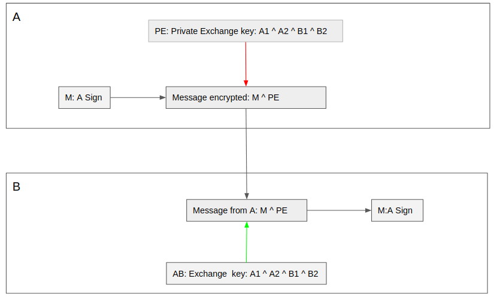

# CIPHER3

cipher3 v0.0.1 on going

# Purpose

Demonstrate a different encryption way respecting the following propositions:

- encryption shouldn't be decryptable using brute force. It should have no way to reverse-engineering it
- do not have complicated mathematical usage, encryption should be simple to understand
- encryption algorithm could be public without make it weaken
- safe authentication of the sender should be possible
- data flow encryption should be fast

# how

One way to got an absolutely not decryptable algorithm is to use a random key as long as the data to encrypt and never reuse two times, so each data to encrypt has its own unique random key

For instance, if the following data:
"Hi, how are you?" is encrypted using a simple xor with the following random key:
"48 E2 8A 23 B2 C8 12 AA 40 32 56 56 22 8D 03 00",
there is no way to decrypt it if you do not have the key
there is also no brute force algorithm able to decrypt it no matter the time used, because xor is just not reversable.

xx ^ yy -> zz
knowing zz, there is no way to found xx and yy without having more information about xx or yy

All the difficulty is to be able to produce a nearly infinite random key and ensure that the key is enough random, to give no information on the key bytes.

Unfortunately, there is no way to produce a fully random key like that using machine code, no matter the algorithm. A random key produce by a machine is never completely random (see chapter "weakness of the solution")

When data is encrypted and decrypted using the key, no matter the encryption/decryption algorithm we can think that the bytes of the key used to encrypt the data are compromised and well known by hackers.
So all the force of the encryption algorithm is that the next byte values of the key can be anticipate using the previous already used key values.

The propose of this project is to use an algorithm working on several pseudo random key (calling space) to generate a flow of not anticipable bytes which are used as final key to encrypt data

to generate the final key, we have to define:
- the number of dimension of the key, each dimension has its own key called "dimension key".
- the "dimension keys" size, all the "dimension keys" of the same space have the same size.

There is several ways to generate a pseudo random key as "dimension keys", at least these two ones:
- use crypto/rand.make golang routine, which is a pretty good one. It's the way we use in this project version
- generate a big random prime (as done in freignat91/cipher project) and extract decimals from its square-root, considering a prime is an irrational, its square-root decimal are not predictable if we don't know the prime. To see for next version, but not sure it increase the strength of the encryption, because the prime generation is at first also based on crypto/rand.make.

Using the dimension keys it's then possible to generate the final key bytes flow extracting all bytes from the space they form using this regular way:

For instance with a 2 dimensions space:

In this example, there are 2 dimension keys having each 3 bytes, the final keys is 9 bytes long composed with all possible xor bytes couple take in the first key k1, and the second key k2

With only 3 dimensions and dimension keys having 16384 bytes long, we got a 4096 GByte final key long.

The algorithm to generate the final key byte is here simple, but it's possible to have an algorithm which generate all the possible values without using the same dimension key byte at each step, for instance in dimension two, like that

keys are scanned changing each time, column and row. This algorithm is possible in dimension n, not easy to implement, but possible.

No matter the scanning algorithm, it's not possible to anticipate the value of bytes of this final key knowing its previous values, because there is always a new, not known, never used before, byte belonging to one dimension key which is used in the xor list to compute the final byte.

to encrypt data the algorithm is then to generate new final keys bytes as long as the data to encrypt and xor them with the plain data bytes and remember the index of the first used byte in the final key.

to decrypt data it's enough to re-generate the final key bytes used to encrypt the data, using the saved index and xor them with the encrypted data.

the index is a number given a position in each dimension key. For instance in a two dimensions space, if n is the dimension key size and K1 and k2 the index in each dimension key, then the final index could be: i = k2 * n + k1

to retrieve each dimension key index value using the final index, we can use the int division and the rest of the int division like that:
k2 = i / n
k1 = i % n

This way of computing index works with any dimensions of the space.

Of course in the real world, we can not use directly the final key like that. Let's call "key" the set of the dimension keys needed to generate the final key.

the private key of the sender can't be used directly because the receiver would need it to decrypt and it could share it with anyone. So we need a safe protocol to build a common private key between sender and receiver.

# solution weakness

The weakness of this solution is linked to the way dimension key are randomly generated. If the random generator is anticipable then the key become also anticipable. So to be absolutely secure it should have a human intervention in the process to generate random dimension key.

However, there are solution too make very complex dimension key byte anticiation, as add a treatment after the generation of the dimension keys which mixes and update the bytes in order to both complicate the reverse-engineering process and ensure the average number of each possible byte values (0 to 255) are about the same (done in this project version)

# generate a private exchange key a safe way

In this protocol:
- A generates a private key which is never send, called A1
- A generates another temporary private key, called A2
- A combines using xor all dimension keys from A1 with A2, creating this way a new key called: A Public Key for B
- A sends it to B a safe way (see chapter "send a key a safe way")
- B do the same for A
- Then A and B have both the keys: A Public key For B and B Public key for A
- they both combines them using xor on their dimension keys to have a new common key: Private Exchange key

this key is the same for A and B and has never been exchanged between them. They now can use it to exchange data.

using this key and the encrypt/decrypt previously explained algorithm, A and B can set a very fast encrypted data flow between them.

if A and B need to exchange encrypted files to be decrypted offline later, then the index of the key used to encrypt the file should be saved with the encrypted file in order to let the receiver known at which index it has to set its own private exchange key before decrypting the file.

This, to achieve the fact that a byte of a final key should never be reused two times to encrypt something. It's naturally the case in the flow of data, but should be especially manage for files.

# send a key a safe way

This protocol use the regular padlocks box exchange:

- A puts a secret in a box and locks it with a padlock
- A sends the box to B
- B receives the box, add its own padlock on the box and sends back it to A
- A receives the box, removes its own padlock and sends back the box to B
- B receives the box, removes its own padlock and can open the box to get the secret

this way the box has been sent all along with one or two padlocks and A and B have not shared any padlock.

if we replace the padlock by the encryption algorithm describe above and knowing that xor result is the same no matter the order that the xor is applied:

On this schema, the data can be the key to send

- A encrypts plain data with its private key
- A sends the ciphered data to B
- B receives the data, encrypts it with its own private key and sends back it to A
- A decrypts the data using its private key and sends back it to B
- B receives the data and decrypts it using its private key, then the data is the plain one.

This worked because the order of the applied xor not matter: x ^ y ^ z = x ^ z ^ y
and the same xor applied two time cancel it:  x = x ^ y ^ y

One important point:
using this protocol, B has at the end:
- the encrypted data xor-ed with a A final private key generated using the A private key
- the plain data
so using a simple xor between them it can retrieve the A final private key values used to encrypt the data,
but because the final key is not anticipable it can't help anyway for next decryption.  

# online authentication

This authentication is usable only when the one to be authenticated is able to exchange data with the one wanted to authenticate.

It uses the same kind of protocol than the previous chapter one, but the exchanged data is here the A signature

# offline authentication

This authentication doesn't need to have A online, B can authenticate A using only its encrypted signature

The only restriction of this way of working is that only B can authenticate A using its signature, because A generate its signature especially for B using their common private exchange key.

# Install

- prerequisite: have go installed and GOPATH set
- install glide: go get glide
- clone this project in ĜOPATH/src/github.com/freignat91/cipher3: git clone git://github.com/freignat91/cipher3
- execute: glide update
- execute: make install
- then the command cipher3 is available

For Ubuntu, you have a pre-build cipher3.ubuntu file you can use without cloning and building the project.

# Test

execute 'make test' to launch the project tests

# Usage

## global options

- --help help on command
- -v verbose, display information during command execution
- -debug: display more information during command execution

not yet achieved...
...

## cipher3 createKey keyPath -d [dimension] -s [size] -r

create a new key and write it on the path [keypath]
-d or --dimension: the number of dimension of the key, default 3
-s or --size: the size of the dimension key, default 16384
-r add manual random input

## cipher3 encryptFile [sourcefilePath] [targetFilePath] [keyFilePath]

- sourcefilePath: the file to encrypt
- targetFilePath: the resulting encrypted file
- keyFilePath: the key to use

speed: ~70 MB / sec

## cipher3 decryptFile [sourcefilePath] [targetFilePath] [keyFilePath]

- sourcefilePath: the file to decrypt
- targetFilePath: the resulting plain file
- keyFilePath: the key to use

speed: ~70 MB / sec
