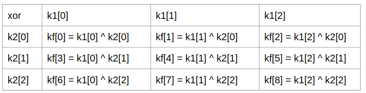
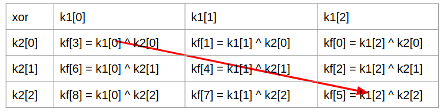
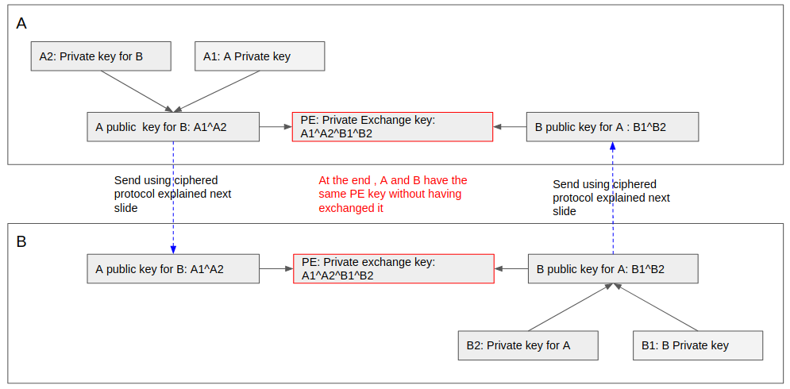
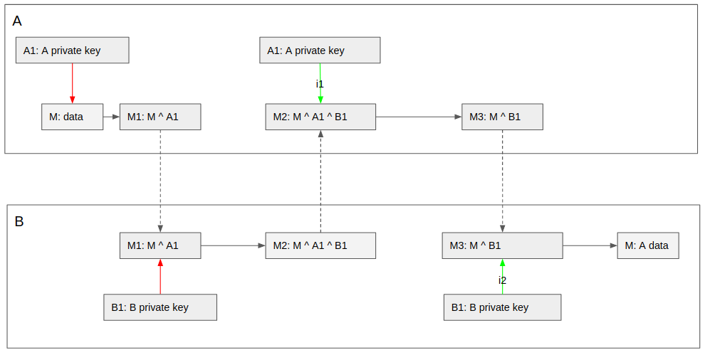
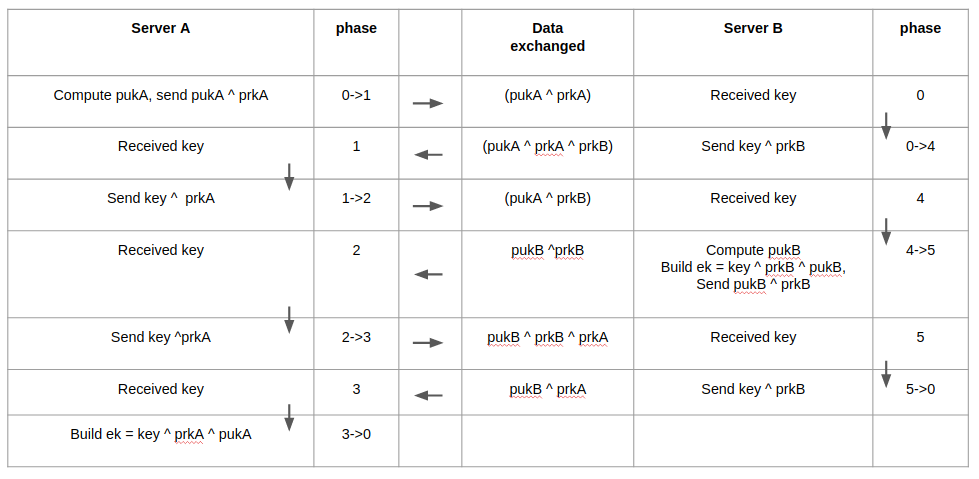

# CIPHER3

cipher3 v1.0.0


# status

This project is done and works well. No new version to come except possible fixes or go upgrade
The main binary, cipher3, is available for unbuntu, os/x and windows64, no need to build the project


# Purpose

Have a file encryption/decryption respecting the following propositions:

- it should not have a way to decrypt encrypted data, including brute force usage no matter the time spent
- it should not have complicated mathematical usage, encryption/decryption should be simple to understand
- encryption/decryption algorithms could be public without make them weaken
- encryption/decryption should be fast

Have a demonstration of protocol allowing to encrypt data-flow between two servers without preexisting keys


# how

One way to get an absolutely not decryptable data is to use a real random key as long as the data to encrypt and never reuse it two times.

For instance, if the following data:
"Hi, how are you?" is encrypted using a simple xor with the following random key:
"48 E2 8A 23 B2 C8 12 AA 40 32 56 56 22 8D 03 00",
there is no way to decrypt it if you do not have the key
there is also no brute force algorithm able to decrypt. It's not a matter of time to spend.

xor is not reversible:

x ^ y -> z
knowing z, there is no way to found x and y without having more information about x or y

so, if the key is really random, there is no way to get information on the key bytes sequence and no way to reverse xor

All the difficulty is to be able to produce a nearly infinite random key and ensure that the key is really random, to do not give information on the key bytes using previous key usage.

Unfortunately, there is no way to produce a fully random key like that using machine code, no matter the algorithm. A random key produce by a machine is never completely random.
One solution to get random bytes is to compute a random key with machine code and xor them with random manual entries given by a human.
We can consider that the key is really random accordingly with the random aspect of the human inputs.
The user has to be very careful during this phase and do not enter mechanically the inputs, but think of them a little.
(see chapter "weakness of the solution").

When data is encrypted and decrypted using the key, no matter the encryption/decryption algorithm we can think that the bytes of the key used to encrypt the data are compromised and well known by hackers.
So all the force of the encryption algorithm is that the next byte values of the key can not be anticipated using the previous already used key values.

The propose of this project is to use an algorithm working on a set of several random keys (calling space) to generate a flow of random not anticipable bytes which are used as final key to encrypt data

to generate the final key, we have to define:
- the number of dimension of the key, each dimension has its own key called "dimension key".
- the "dimension keys" size, all the "dimension keys" of the same space have the same size.


There are several ways to generate a random key as "dimension keys":

First, generate pseudo random keys as for instance:
  - using crypto/rand.make golang routine (which is a pretty good one). It's the way used in this project version
  - generating a big random prime (as done in freignat91/cipher project) and extracting decimals from its square-root, considering a prime is an irrational, its square-root decimal are not predictable if we don't know the prime. Not sure it increases the strength of the encryption, because the random prime generation is at first also based on crypto/rand.make.

Second, adding to them human manual entries, for each dimension key:
- ask the user to input a random set of keyboard hits, any number, more it's long, better it is, why not only (0 to F) to cover with couples of them all the range of bytes
- convert them into a byte array and xor them to all the dimension key, loop on the array if needed

Using these random dimension keys it's then possible to generate the final random key bytes flow extracting all bytes from the space they form using this regular way:

For instance with a 2 dimensions space:



In this example, there are 2 dimension keys (k1 and k2) having each 3 bytes, the final keys (kf) is 9 bytes long composed with all possible xor bytes couples taken in the first key k1, and in the second key k2

With only 3 dimensions and "dimension keys" having 16384 bytes long, we got a 4096 GByte final key long.

The algorithm to generate the final key bytes is here simple, but it's possible to have an algorithm which generate all the possible values without using the same "dimension key" byte at each step, for instance in dimension two, like that



keys are scanned changing each time both column and row (except for the second and the last pf bytes) This algorithm is possible in dimension n.

No matter the scanning algorithm, with dimension keys randomly generated using manual inputs, it's not possible to anticipate the value of bytes of this final key knowing its previous values, because there is always a new, not known, never used before, not anticipable byte belonging to one dimension key which is used to xor the next final byte.

to encrypt data in file the algorithm is:
- remember the current key index, creating an header in the targeted file
- generate final key bytes array and xor them with the file data bytes and save them in the targeted file
- remember the current index of the key (to do not reuse already used bytes), saving the key with its last index

to decrypt data:
- get the index of the key reading file header and set the key index with it
- generate again the final key sequence, xor them with the data, and save them in the targeted file


the index is a list of number given a position in each dimension key. There as many number "dimension key index" in this list then dimension in the key


When a file is encrypted, the key should be saved at the end with the last values of its indexes.
The file format of a key in this project implementation is:

I11 I12 I13 I14 I15 K11 K12 K13 K14 ...  K1n \n
I21 I22 I23 I24 I25 K21 K22 K23 K24 ...  K2n \n
I31 I32 I33 I34 I35 K31 K32 K33 K34 ...  K3n \n

where:
- Ix1 to Ix5: the index hexadecimal value of the xth dimension key index expressed using 5 bytes (so from 0 to 1048575)
- Kx1 to Kx...: the values of the xth dimension key
- n equal to the dimension size of the key

When a file is encrypted, it has a header which is the list of dimension key indexes used to encrypt it at the beginning of the encryption (all the final key bytes has been used before and should not be reused)
The header format in this project implementation is:

I11 I12 I13 I14 I15 I22 I22 I23 I24 I25 ... In1 In2 In3 In4 In5

where:
- In1 to In5: the hexadecimal dimension key index value of the xth dimension key expressed using 5 bytes (so from 0 to 1048575)
- n equal to the dimension size of the key


Out of files, it's also possible to encrypt data flow between a server and a client or two servers, using this solution and appropriate handcheck in order to create on a secure way, the same key, on each side. (see generate a private exchange key a safe way)

Of course to secure completely such data flow between a client and a server, avoiding man in the middle, and much more hacking issues, it's needed to add authentication using asymmetric keys and chain of certificates. This is not in this project version purpose which implement a cipher data flow without authentication, for test.


# solution weakness

The weakness of this solution is linked to the way dimension keys are randomly generated. If the random generator is anticipable then the key become also anticipable. So to be absolutely secure it should have a human intervention in the process to generate random dimension key. For that use the -r option of the createKey cipher3 command line.

However, there are solution too make very complex dimension key byte anticipation, as add a treatment after the generation of the dimension keys which mixes and update the bytes in order to both complicate the reverse-engineering process and ensure the average number of each possible byte values (0 to 255) are about the same (done in this project version by default)


# generate a private exchange key a safe way

To generate a common private exchange key usable by two partners to exchange encrypted data with no preexisting keys, this protocol is possible:

It's out of any authentication, this protocol consider that the parters trust one to each other, but it ensures at least that no plain data is sent on the line. Someone sniffing the line, reading any data, could not deduct key values or decrypt data.



In this protocol:
- A generates a private key which is never send, called A1
- A generates another private key especially for B, called A2
- A combines using xor all dimension keys from A1 with A2, creating this way a new key called: "A Public Key for B"
- A sends it to B a safe way (see chapter "send a key a safe way")
- B do the same for A
- Then A and B have both the keys: "A Public key For B" and "B Public key for A"
- they both combines them using xor on their dimension keys to generate a new common key: Private Exchange key

this key is the same for A and B and has never been exchanged between them. They now can use it to exchange data.

using this key and the encrypt/decrypt previously explained algorithm, A and B can set a very fast encrypted data flow between them.

In case of error, it has desynchronization between the sender key index and the receiver key index, then it's needed to re-compute a new exchange key using this handcheck protocol


# send a key a safe way

This protocol use the regular padlocks box exchange:

- A puts a secret in a box and locks it with a padlock
- A sends the box to B
- B receives the box, can't open it, because of A padlock and add its own padlock on the box and sends back it to A
- A receives the box, removes its own padlock and sends back the box to B
- B receives the box, removes its own padlock and can open the box to get the secret

this way the box has been sent all along with one or two padlocks and A and B have not shared any padlock key.

if we replace the padlock by the encryption algorithm describe above and knowing that xor result is the same no matter the order that the xor is applied:

On this schema, the data can be the key to send



- A encrypts plain data with its private key
- A sends the ciphered data to B
- B receives the data, encrypts it with its own private key and sends back it to A
- A decrypts the data using its private key and sends back it to B
- B receives the data and decrypts it using its private key, then the data is the plain one.

This worked because the order of the applied xor not matter: x ^ y ^ z = x ^ z ^ y
and the same xor applied two times cancel it:  x = x ^ y ^ y

The complete protocol is there:



One important point:
using this protocol, B has at the end:
- the encrypted data xor-ed with A private key
- the plain data
so using a simple xor between them it can retrieve the A final private key values used to encrypt the data,
but because the next final key bytes is not anticipable it can't help anyway to hack the next encrypted data

Another point:
This protocol using a private key on one side shouldn't be used to send the private key it-self, because on the other side all the dimension keys forming the A private key will be discover.Private key should stay private and never be sent anyway.


# Install

- prerequisite: have go installed and $GOPATH set
- install glide: go get glide
- clone this project in ĜOPATH/src/github.com/freignat91/cipher3: git clone git://github.com/freignat91/cipher3
- execute: glide update
- execute: make
- then the command cipher3 is available (and  the command testServer)

They are pre-build cipher3 binaries for For ubuntu, win64 and osx in ./bin, you can use one of them directly without building the project.


# Usage with files

For personal use, if you want to save encrypted files or directories on services like dropbox


# tests
execute 'make test' to launch the file encryption project tests


## global command line cipher3 options

- --help help on command
- -v verbose, display information during command execution
- -debug: display more information during command execution


## cipher3 createKey [keyPath] [dimension] [size] -random

create a new key and save it on a file:
- keyPath: file path of the key
- dimension: the number of dimension of the key
- size: the size of the dimension key
- random (-r): optional argument add manual random input, one per dimension, all keyboard characters is accepted, any size. It's used have true random dimension keys

example: cipher3 createKey /tmp/test.key 3 16384 -r


## cipher3 encryptFile [sourcefilePath] [targetFilePath] [keyFilePath]

- sourcefilePath: the file to encrypt
- targetFilePath: the resulting encrypted file
- keyFilePath: the key to use

example: cipher3 encyptFile /tmp/myPlain /tmp/myCiphered /tmp/test.key


## cipher3 decryptFile [sourcefilePath] [targetFilePath] [keyFilePath]

- sourcefilePath: the file to decrypt
- targetFilePath: the resulting plain file
- keyFilePath: the key to use

example: cipher3 decyptFile /tmp/Ciphered /tmp/myPlain /tmp/test.key


## encrypt a directory

to encrypt a directory use the script sample or similar ./tests/encryptFile.sh

```
#!/bin/bash

tar cvf /tmp/$2.tmp $1
if [ $? -eq 0 ]
then
   cipher3 encryptFile /tmp/$2.tmp $2 $3
fi
rm /tmp/$2.tmp
```

usage: encryptFile [source directory path] [targeted encrypted file] [key path]


## decrypt a directory

to decrypt a directory use the script sample or similar ./tests/decryptFile.sh

```
#!/bin/bash

cipher3 decryptFile $1 /tmp/$1.tmp $2
if [ $? -eq 0 ]
then
  tar xvf /tmp/$1.tmp
fi
rm /tmp/$1.tmp
```

usage: decryptFile [encrypted file source path] [key path]
it create the same directory name than the one encrypted on .


# Tests using communication between distinct servers


## test script

to test encrypted communication between two servers, use the script ./tests/testServers.sh or execute the following commands:

```
cipher3 stopServer :3001
cipher3 stopServer :3002
sleep 1
cipher3 launchServer :3001 test1
cipher3 launchServer :3002 test2
sleep 1
cipher3 handcheckServer :3001 :3002
cipher3 sendData :3001 test2 "Hey, how are you test2?"
cipher3 sendData :3002 test1 "good!"
```


## cipher3 launchServer [host:port] [name]

Launch a new server in a separate process, arguments are:
- host:port: the host name and the port, format host:port, that other servers should used to send REST calls to this server
- name: the logical name of the server

examples:
- cipher3 launchServer localhost:3001 test1
- cipher3 launchServer :3002 test3 (localhost is the host default)

It's better to launch servers in a separate consoles in order to have a clear view of there logs
The server create its own private key on the fly, never shared, memory only (for now there is no option to enter random keyboard inputs)

Servers can be launch directly using the command: testServer [host] [port] [name]


## cpiher3 stopServer [host:port]

Stop a server, argument is:
- [host:port]: the addr of the server to stop

example:
- cipher3 stopServer localhost:3001


## cipher3 handcheckServer [fromHost:fromPort] [tohost:toPort]

Execute the previously explained handcheck protocol to have the same private exchange key shared by the partners, arguments are:
- [fromHost:fromPort]: the host:port of the server which is going to initiate the handcheck
- [toHost:toPort]: the host:port of the server to connect with

then servers know one to each other by their logical name and are ready to exchange any secure data

example:
- cipher3 handcheckServer localhost:3001 localhost:3002


## cipher3 sendData [host:port] [name] [data]

Make the server [host:port] sends data to the server called [name], arguments are:
- [host:port]: the host name and port of the server, format host:port, which is going to send the encrypted data
- [name]: the name of the server which is going to received the encrypted data and to display the plain result for the test
- [data]: the data

example:
- cipher3 sendData localhost:3001 test2 "I, how are you?"
